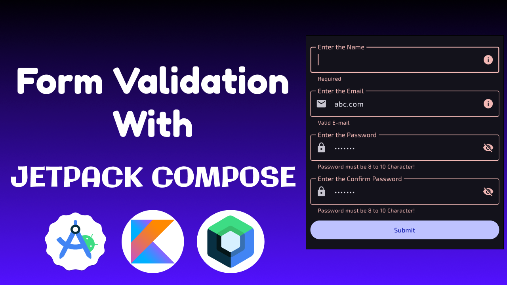

# Full Guide: How to Form Validation With Jetpack Compose

## [check out all my Medium article here](https://medium.com/@meet26)

## [check out my article output](https://youtu.be/8M_CNcVWHx0)

## ❤ Show your support

Give a ⭐️ if this project helped you!

Your generosity is greatly appreciated! Thank you for supporting this project.

## Connect with me

## Author

**Meet**
